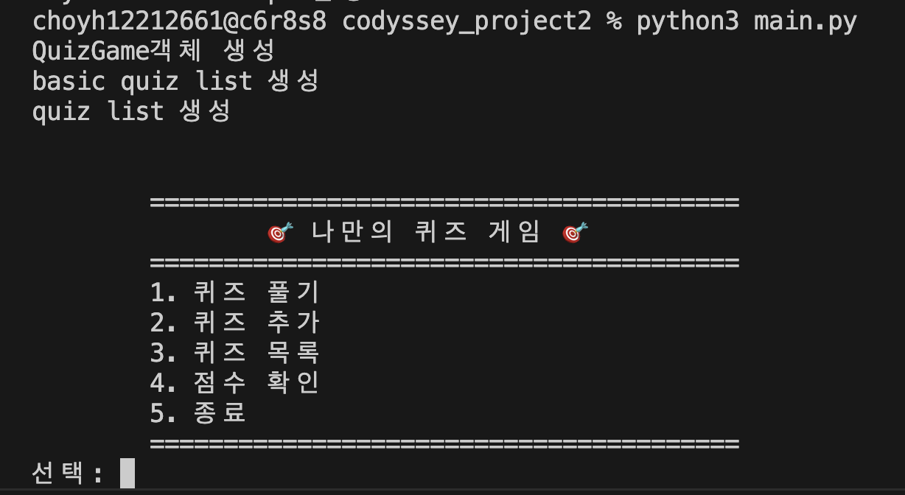
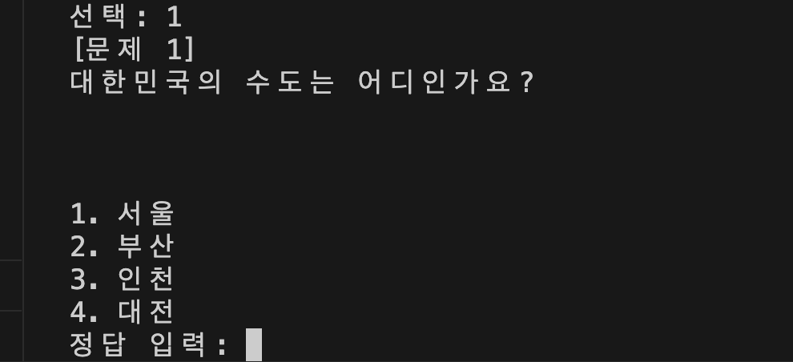
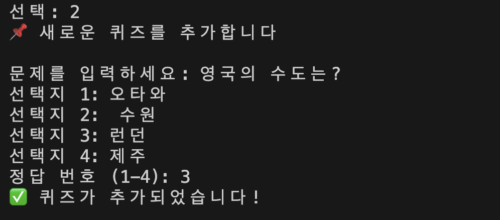
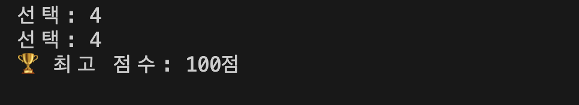

# 컴퓨터에게 명령 내리는 말(파이썬) 처음 배우기

# 1. 프로젝트 개요
- 프로그램을 실행하면 메뉴가 화면에 표시되고 원하는 메뉴를 선택할 수 있습니다. 
- 퀴즈 풀기, 퀴즈 추가, 문제 목록 확인, 점수 확인등의 작업을 수행 할 수 있습니다.

# 2. 퀴즈 주제와 선정 이유
- 상식 퀴즈인 나라 수도를 주제로 선정하였습니다.

# 3. 실행 방법
- 프로젝트 티렉토리의 터미널에서 `python3 main.py`을 통해 프로그램을 실행할 수 있습니다.

# 4. 기능 목록
- 퀴즈 풀기: json파일로 저장된 퀴즈 들을 풀거나 저장된 퀴즈 목록이 없을 경우 기본 퀴즈들을 풉니다
- 퀴즈 추가: 새로운 퀴즈를 json 파일에 추가하고 퀴즈 목록을 업데이트 합니다 
- 문제 목록 확인: 현재 저장된 퀴즈 등의 질문을 출력합니다. 저장된 퀴즈목록이 없을 경우 기본 퀴즈들의 질문을 출력합니다
- 점수 확인: 최고 점수를 확인합니다

# 5. 파일 구조
```text
.
├── main.py                 # 프로그램 실행 시작점
├── quiz.py                 # Quiz 클래스
├── quizgame.py             # QuizGame클래스
├── utils.py                # 유틸 함수
├── state.json              # 퀴즈 목록, 최고 점수 저장
├── README.md
└── .gitignore
```

# 6. 주요 클래스
## Quiz
- 속성
    - `question`: 퀴즈의 질문을 저장하는 문자열
    - `choices`: 퀴즈의 보기를 저장하는 문자열 리스트
    - `answer`: 퀴즈의 정답을 저장하는 int 변수
- 주요 메서드
    - `print_question`: 퀴즈의 질문을 출력한다
    - `check_answer`: 퀴즈의 정답이 맞는지 확인한다
    - `to_dict`: 퀴즈의 속성값을 딕셔너리 형태로 반환한다
## QuizGame
- 속성
    - `basic_quiz_list`: 기본 퀴즈 리스트
    - `quiz_list`: json 데이터로 부터 객체로 추출한 퀴즈 리스트
    - `best_score`: 최고 점수
- 주요 메서드
- `run`: 게임의 메인 루프를 실행하여 사용자가 종료를 선택할 때까지 메뉴를 반복해서 보여줍니다.
- `show_menu`: 사용자가 선택할 수 있는 게임 메뉴 화면을 콘솔에 출력합니다.
- `add_basic_quiz`: 코드 내에 고정된 5개의 기본 퀴즈 리스트를 생성하여 반환합니다.
- `add_quiz`: 문제, 선택지, 정답을 받아 유효성을 검사한 후 Quiz 객체를 생성합니다.
- `exec_menu`: 사용자가 입력한 메뉴 번호에 따라 그에 맞는 기능(메서드)을 연결하여 실행합니다.
- `solve_quiz`: 전체 퀴즈 풀기를 진행하고, 최종 점수를 계산하여 최고 점수를 갱신합니다.
- `print_quiz`: 특정 퀴즈의 문제 번호, 질문, 4개의 선택지를 형식에 맞춰 출력합니다.
- `submit_answer`: 사용자로부터 답을 입력받아 해당 퀴즈의 정답 여부를 판별합니다.
- `get_json_quiz_data_as_instance`: JSON 파일에서 퀴즈 데이터를 읽어와 Quiz 객체 리스트로 변환합니다.
- `add_quiz_to_json`: 사용자에게 새 퀴즈 정보를 입력받아 파일에 저장하고 현재 퀴즈 목록을 업데이트합니다.
- `dump_quiz_data`: 전달받은 새로운 퀴즈 객체를 JSON 파일에 추가하여 영구적으로 저장합니다.
- `check_quiz_list`: 현재 게임에 로드된 모든 퀴즈의 질문 목록을 화면에 보여줍니다.
- `get_best_score`: JSON 파일로부터 기존에 기록된 최고 점수 데이터를 읽어옵니다.
- `dump_best_score_data`: 새롭게 달성한 최고 점수를 JSON 파일에 기록하여 저장합니다.
- `print_best_score`: 현재까지 기록된 최고 점수를 화면에 출력합니다.

# 7. 실행 흐름
- main -> QuizGame객체 생성(베이직 퀴즈 리스트 생성, json데이터 객체로 전환, 최고점수 받아오기) 
-> run 루프 실행 -> 메뉴 출력 -> 실행 동작 입력 받기 ->  퀴즈 풀기 선택
->  퀴즈 내용 출력 및 풀기 ->  점수 출력 및 최고 점수 업데이트 

# 8. 데이터 파일 설명
- 딕셔너리 구조로 `quizzes`와 `best_score` 두개의 키값이 존재한다
- `quizzes`키는 퀴즈 목록 리스트를 밸류로 가지며 
- 퀴즈 목록 리스트는 퀴즈 질문, 보기, 정답 등을 키로 갖는 딕셔너리들을 원소로 가진다

# 9. 스크린샷



